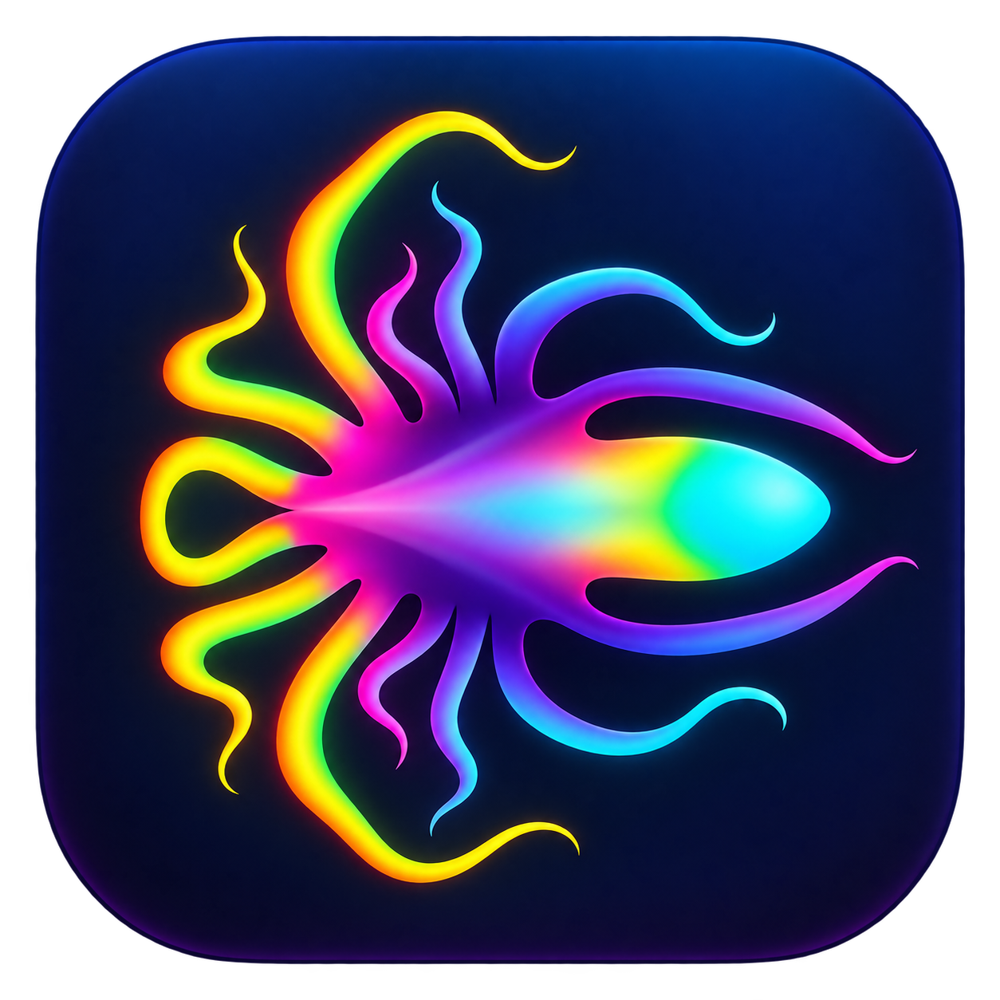

# ScreamSeq



ScreamSeq is a native tracker DAW with precise note timing, sample instruments,
plugin hosting, and connected views of patterns, automation and signal flow.
It builds on OpenMPT's playback engine with a shared C++ song model and native
macOS and Windows frontends. ScreamSeq is an independent project, not an official
OpenMPT release.

## What you can do

- **Write patterns and arrangements.** Keyboard-driven note entry, independent
  playback and editing cursors, pattern/order tools, fractional note timing,
  musical tempo and groove, and one to eight FX columns per channel.
- **Shape samples and instruments.** Waveform drawing, range processing,
  clipboard editing, loop crossfades, sample libraries, multi-sample mappings,
  and volume, pan, pitch and filter envelopes.
- **Record and resample.** Capture microphone/interface input, or turn selected
  pattern rows and channels into a new sample or instrument with one Undo.
  See [recording samples](doc/SCREAMSEQ_SAMPLING.md).
- **Host effects and instruments.** Built-in processors and native plugin
  interfaces, searchable parameters, presets, shared instrument assignments
  and MIDI channels. macOS hosts AU and VST3; Windows hosts VST3.
- **Connect processing and modulation.** Track/group/return buses, inserts,
  sends, sidechains, reusable processing graphs, song-level modulation sources,
  parameter links and signal inspection.
- **Automate the music.** Pattern parameter envelopes, recorded automation,
  reusable envelope shapes, compiled curve formulas and precise graph commands.
- **Compose sample scratches.** Sequence reusable paired motion/fader envelopes,
  scripted curves and independent variations with inline pattern controls.
- **Edit through a local API.** External tools and agents can inspect and change
  songs through guarded JSON operations. Musical edits use stable identities,
  revision checks, Undo and native project persistence.
- **Import and export.** Edit MOD, XM, S3M, IT and MPTM songs, preview other
  engine-supported formats, save native projects and export modules with checks
  for native-feature loss. The macOS app also exports rendered stereo WAV.

The [macOS guide](mac/README.md), [graph guide](mac/GRAPH_WORKFLOW.md),
[precise-note guide](mac/PRECISE_NOTES.md) and [scratch guide](doc/SCREAMSEQ_SCRATCH_PHRASES.md)
describe the most developed interface.
Platform coverage differs; Windows is an implemented editing frontend with
parity work still in progress.

## Platforms and status

| | macOS | Windows |
| --- | --- | --- |
| Native interface | Swift/AppKit, Metal pattern grid | Win32, Direct2D/DirectWrite over Direct3D 11/DXGI |
| Audio and plugins | Core Audio, CoreMIDI, AU/VST3 | WASAPI, VST3 |
| Local API transport | Private Unix socket | Private PID-scoped named pipe |
| Development state | Broad editing and graph workflows; supported live routing transitions | Patterns, samples, instruments, plugins, envelopes and graph editing; newer live structural-edit publication and full parity remain unfinished |

**This is development software and is not release-qualified.** The strict
sustained 60 fps gate remains unmet. General note/MIDI graph routing, arbitrary
live graph topology changes, broader commercial-plugin coverage and final
cross-platform qualification remain open. Unsupported live edits preserve the
accepted audio plan or require stopped preparation, according to the host.

The [1 October graph checkpoint](doc/mac-native-qualification/2026-10-01-graph-resume/STOPPAGE_REPORT.md)
records the measured scope and remaining graph work. It is a dated checkpoint,
not a guarantee for every build or plugin. Windows implementation boundaries are
documented in [application integration](windows/App/INTEGRATION.md); its earlier
native qualification is collected in [the continuation record](windows/RESUME_PROGRESS.md).

## Build and run

From the repository root, on macOS 14 or newer with Xcode command-line tools and
CMake:

```sh
bash mac/build-background.sh
open bin/mac-background/ScreamSeq.app
```

This uses a separate development bundle and two compile workers. The build is
locally ad-hoc signed. See [macOS build and test details](mac/README.md).

On Windows with Visual Studio 2022 C++ Build Tools, a Windows SDK and CMake 3.24+:

```powershell
./windows/build.ps1 -Architecture x64 -BuildDirectory bin/windows-dev -Test
./bin/windows-dev/Release/ScreamSeq.exe
```

Use `-Architecture ARM64` for a native ARM64 build. See the
[Windows guide](windows/README.md) for build requirements, test scope and limits.
Use a fresh build directory when another development instance is already running.

## Projects and automation

New projects use `.screamseq`. The current native format is container 6 /
metadata 17. Incompatible native files load best effort: understood data is
validated and recovered, with warnings for conversions or skipped content.
Recovered files that require conversion or lose data must be saved as a new copy
to protect the original. Files without a readable embedded song still cannot be
opened. OpenMPT module import remains supported. Platform-specific plugins must
be available on the destination platform: AU state is preserved on Windows, but
AU processors cannot run there.
The current sample engine uses 8/16-bit sample storage.

The local API exposes capabilities through `api.describe`; clients must query
the running host rather than assume complete platform parity. See the
[API guide and Python client](mac/AUTOMATION.md),
[machine-readable schema](mac/Tools/resonance-api.schema.json) and
[Windows API subset](windows/Api/README.md). No language model is embedded in
the application. Legacy Resonance storage and plugin identifiers remain
intentional [compatibility contracts](assets/branding/BRANDING.md).

## Development and attribution

`main` is the ScreamSeq integration branch. Start with
[contributing](CONTRIBUTING.md), the [architecture](doc/SCREAMSEQ_ARCHITECTURE.md)
and the [UI philosophy](doc/RESONANCE_UI_PHILOSOPHY.md). Shared musical behavior
belongs in `editor/` and the engine; native UI and device hosting belong in
`mac/` or `windows/`.

ScreamSeq retains OpenMPT's history, code and attribution. The project is covered
by the [BSD-3-Clause license](LICENSE), with separate licenses for bundled
third-party components. See [upstream provenance and notices](UPSTREAM.md).
