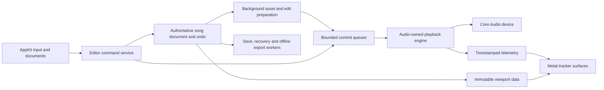

**Plan for a native macOS tracker based on OpenMPT**

Prepared 18 September 2026 against commit `f83cedb0cd5446e4dfaa83ac97e3087107e26767` (29 August 2026). This is an implementation proposal grounded in source inspection and a local macOS build check. Performance numbers below are proposed acceptance criteria, not measured results for an application that already exists.

Implementation update: see [MAC_NATIVE_PROGRESS.md](MAC_NATIVE_PROGRESS.md) for the application, measured results and remaining gates. The analysis and estimates below are the original planning baseline.

**Recommendation: retain OpenMPT's musical engine and build a new native editor around it.**

Use Swift and AppKit for the application, Metal for the dense tracker surfaces, and the existing C++ engine behind a small Objective-C++/C boundary. Build a portable editing layer by extracting selected OpenMPT operations. Make Core Audio integration, predictable memory ownership, playback fidelity, and frame pacing prerequisites for the first playable release.

Assume an initial Apple silicon application, macOS 14 or later, one actively playing document, and local files. Treat Intel distribution as a separately qualified target. These are planning defaults, not requirements inferred from the existing Windows product. Native here means native windows, menus, input, accessibility, document behavior, graphics, and audio integration.

**What the repository actually provides**

Source/header line counts, including comments and blank lines, illustrate the size of the separation task; they are not estimates of work or reuse percentages.

| Area | Observed size | Use in the Mac application |
|---|---:|---|
| `soundlib/` | 208 files; 99,030 lines | Retain loaders, writers, effect semantics, sequencing, mixing, sample and instrument structures. Isolate tracker dependencies and audit the render path. |
| `sounddsp/` | 8 files; 2,402 lines | Reuse appropriate built-in processing with explicit settings and fidelity tests. |
| `tracklib/` | 5 files; 2,121 lines | Good candidates for sample editing and offline stretch/pitch operations; adapt synchronization and ownership. |
| `mptrack/` | 229 files; 128,374 lines | Reference implementation for behavior. Extract useful domain operations; replace MFC windows, controls, drawing, and application services. |
| `libopenmpt/` | 29 files; 14,222 lines | Portable playback API, independent reference renderer, and integration examples. Insufficient as the full editor API. |
| `common/`, `src/mpt/`, `src/openmpt/` | Substantial shared infrastructure | Reuse portable primitives selectively; avoid pulling Windows application services into the new core. |

The important boundaries are concrete:

| Finding | Source evidence | Consequence |
|---|---|---|
| macOS playback portability already exists. | [macOS make configuration](/Users/rewbs/code/openmpt/build/make/config-macos.mk), [macOS CI](/Users/rewbs/code/openmpt/.github/workflows/macOS-Makefile.yml), [build instructions](/Users/rewbs/code/openmpt/doc/libopenmpt/gettingstarted.md:209) | Start from this working C++ build. Existing Xcode generation targets libopenmpt, not a native tracker application. |
| Document state, undo, and Windows services are combined. | [CModDoc](/Users/rewbs/code/openmpt/mptrack/Moddoc.h:118), [undo types](/Users/rewbs/code/openmpt/mptrack/Undo.h:24) | A new document/controller layer is substantive engineering, not a UI wrapper. |
| Rendering uses a custom bitmap/GDI implementation. | [pattern drawing](/Users/rewbs/code/openmpt/mptrack/Draw_pat.cpp:529) | Reuse layout concepts, colors, and formatting semantics; implement a new renderer and input layer. |
| The public library normally excludes saving and several tracker DSP options. | [build switches](/Users/rewbs/code/openmpt/common/BuildSettings.h:144) | Do not build the editor by treating stock libopenmpt as an editable document library. Its interactive extensions control playback, but do not provide general pattern editing and module saving. |
| Internal writers are already present. | [writer declarations](/Users/rewbs/code/openmpt/soundlib/Sndfile.h:932), [IT/MPTM writer](/Users/rewbs/code/openmpt/soundlib/Load_it.cpp:1513) | Enable and test them in a production editor-core configuration. Do not ship with test-only build switches to obtain saving. |
| The audio callback and editor share a global recursive lock. | [callback locking](/Users/rewbs/code/openmpt/mptrack/MainFrm.cpp:821), [CriticalSection](/Users/rewbs/code/openmpt/soundlib/AudioCriticalSection.h:20) | Replace this coordination model in the Mac application. A mutex shared with drawing, loading, or editing is unacceptable on the new callback path. |
| Core and tracker still have cross-dependencies. | [Sndfile.cpp includes](/Users/rewbs/code/openmpt/soundlib/Sndfile.cpp:30), [Snd_fx.cpp includes](/Users/rewbs/code/openmpt/soundlib/Snd_fx.cpp:21) | Twenty `soundlib` source/header files reference `mptrack/`; many references are conditional. Extract capabilities and narrow host interfaces instead of defining `MODPLUG_TRACKER` wholesale. |
| A playback-state seam exists, but ownership is not yet independent. | [PlayState](/Users/rewbs/code/openmpt/soundlib/PlayState.h:23), [pattern ownership](/Users/rewbs/code/openmpt/soundlib/pattern.h:27), [voice pointers](/Users/rewbs/code/openmpt/soundlib/ModChannel.h:63) | `CSoundFile` is not a cheaply swappable immutable snapshot. Voices and patterns contain references into its data. |
| Float output does not imply an internally floating-point mixer. | [mixer selection](/Users/rewbs/code/openmpt/soundlib/Mixer.h:19), [output conversion](/Users/rewbs/code/openmpt/soundlib/AudioReadTarget.h:99) | Preserve the current fixed-point mixer initially, convert through existing routines to float32 output, and retain its established behavior. |
| Strong test scaffolding already exists. | [load/save tests](/Users/rewbs/code/openmpt/test/test.cpp:4397), [playback traces](/Users/rewbs/code/openmpt/soundlib/PlaybackTest.h:31) | Extend these rather than relying only on listening tests. |

**Architecture and technology choices**

| Responsibility | Proposed implementation | Reason |
|---|---|---|
| App shell, menus, documents, panels | Swift + AppKit; `NSDocument` integration | Direct control over keyboard focus, document lifecycle, windows, and native behavior. SwiftUI can be used selectively for low-frequency settings. |
| Pattern grid, waveform, envelopes, meters | AppKit-hosted `MTKView` | One virtualized drawing surface per editor, batched text/geometry, explicit presentation timing. |
| Editing and song semantics | Portable C++ core plus new editor commands | Keep a single definition of tracker semantics across UI, playback, and export. |
| Swift/core boundary | Small Objective-C++ adapter over opaque handles and value records | Keep C++ ownership private; expose batched viewport data and asynchronous operations. No per-cell interop calls per frame. |
| Device output | Core Audio HAL Output Audio Unit, controlled outside the callback | Explicit device selection, negotiated format/buffer size, and timestamps. Apple's [Core Audio overview](https://developer.apple.com/library/archive/documentation/MusicAudio/Conceptual/CoreAudioOverview/ARoadmaptoCommonTasks/ARoadmaptoCommonTasks.html) documents this device/output relationship. |
| Build | Xcode app target; dedicated CMake core/test targets; retain upstream Makefile oracle | Separate the new product's build from Windows solutions and make headless core tests easy to run. Derive source lists and capability settings from the checked-in build, then keep them explicit. |
| Distribution | Signed, notarized app for direct download initially | Qualify packaging early; defer App Store-specific distribution work until the product scope is stable. |

The repository also has an RtAudio backend with a Core Audio case. It is useful reference code and an alternative prototype path. Direct Core Audio is the recommended product backend because this product specifically needs native device lifecycle and timing control. This is an architectural choice, not a claim that an abstraction layer inherently sounds worse.



The proposed new source areas are `mac/` for the app, bridge, graphics and device adapter, and `editor/` for portable commands, snapshots, undo and host interfaces. These directories do not exist yet. Retain upstream code in its current directories to make future merges reviewable.

Add explicit editing, saving, external-sample, DSP and host-service capabilities to the build configuration, preserving current library and Windows defaults. The names and exact macro arrangement should be settled in the first extraction change. `LIBOPENMPT_BUILD_TEST` is evidence that non-MFC saving is possible; it is not the production configuration. The extracted target must compile without including `mptrack/` headers.

**Audio ownership must be designed before editing is added**

The audio callback owns the running engine and all mutable playback state. The editor owns the authoritative musical document, its revision history, and undo. A serialized control service converts accepted editor transactions into bounded audio commits. Workers own loading, decoding, analysis, saving, recovery, and offline export. The UI reads presentation snapshots and telemetry, never the live `CSoundFile`.

Keep upstream pattern/effect/instrument representations where possible. Introduce revisioned song data and a playback representation incrementally through adapters; do not duplicate effect interpretation in Swift. Use the existing `PlayState` separation as a starting point, while acknowledging that sample, instrument, and pattern ownership needs further work.

For each edit:

1. Validate the command against the format's limits and current document revision. Record undo and update the document on its owning thread.
2. For small fixed-size edits, prepare a bounded command. For a paste, resize, sample replacement, or instrument change, prepare replacement storage and derived playback data off the audio thread.
3. Publish a versioned transaction through a bounded queue. Apply ordinary data edits at a documented musical boundary, normally before a subsequent row is decoded. Timestamped audition/MIDI events can divide a render block at sample offsets. Define transport and parameter behavior separately.
4. Acknowledge the applied revision. The UI may show an edit immediately, but must know when the running engine has adopted it. Preserve ordering through undo/redo, seeks, and document switches; reject stale transactions explicitly.
5. Retire old storage to a worker only after the audio side acknowledges that it is no longer referenced. Active voices can retain sample/instrument data across many callbacks: a buffer-boundary acknowledgement alone is insufficient.

Use stable sample/instrument slot identities and explicit lifetime tracking. Either allow existing voices to finish with old assets, or retarget them with bounded, tested logic at a commit point. Existing [sample retargeting](/Users/rewbs/code/openmpt/soundlib/modsmp_ctrl.cpp:338) is useful reference. Swapping a `shared_ptr`, assigning a vector, or exchanging an entire `CSoundFile` is not automatically safe: destruction, voice resets, dangling references, and memory reclamation all need attention.

Use a single-producer/single-consumer control queue after serialization. MIDI, when introduced, gets its own timestamped producer queue and an explicit bounded merge policy. Limit work per callback. Queue saturation must produce backpressure for edits, permit coalescing of obsolete meter/parameter updates where valid, and retain a reserved stop/all-notes-off mechanism so overload cannot leave a note stuck. Telemetry may drop old snapshots; musical transactions must not disappear silently.

For early milestones, unsupported large structural edits may require stopping transport. That limitation must be explicit in the UI. Normal note entry, preview, mute/solo, and supported edits during playback must never serialize and reload the whole song. Introduce broader live structural editing only after the relevant lifetime and deadline tests pass.

**The first release needs a render-path audit, not just a Core Audio callback**

| Observed hazard or seam | Required work |
|---|---|
| [RowVisitor initialization and insertion](/Users/rewbs/code/openmpt/soundlib/RowVisitor.cpp:83), called from playback in [Sndmix](/Users/rewbs/code/openmpt/soundlib/Sndmix.cpp:554) | Precompute structure-dependent storage off-thread; implement bounded loop-state storage and an allocation-free reset. Existing reservations are not proof of a hard upper bound. Define capacity exhaustion behavior without silently changing loop semantics. |
| [MIDI macro scratch resizing](/Users/rewbs/code/openmpt/soundlib/Snd_fx.cpp:5492) | Preallocate to validated limits and inspect all reachable macro/plugin paths. Some macros affect internal playback even without external plugins. |
| Global tracker mutex and notification mutexes | Use audio-owned state and bounded queues; do not copy `CMainFrame`'s audio orchestration. |
| Sample edits and container mutations allocate, free, and update pointers | Prepare data in workers and commit through audited operations; reclaim off-thread. |
| Module creation, duration analysis, seeking, lazy initialization | Load and warm resources off-thread. Implement explicit fast-position versus accurate-state-seek semantics. Long accurate seeks need a background prepared engine/state and a controlled transition. |
| Built-in DSP, synthesis, emulations and optional plugins | Include their first-use, reset, parameter, and exceptional paths in the audit. Do not assume everything below `Read()` is allocation-free. |

A callback must perform no heap allocation or destruction, blocking lock, file access, logging, UI work, Swift task scheduling, or unbounded traversal. Use preallocated buffers and failure records; handle those records outside the callback. Marking a function `noexcept` is not proof that it satisfies these conditions.

Start with one audio render thread. Core Audio already places its render thread in the device workgroup; add workgroup membership only if creating auxiliary real-time threads later. Apple's [Audio Workgroups documentation](https://developer.apple.com/documentation/audiotoolbox/understanding-audio-workgroups) explains this distinction. General worker pools are for non-real-time preparation, not buffer rendering.

**Audio quality and timing requirements**

Retain tracker compatibility flags, timing modes, effect memory, interpolation choices, sample loops, volume ramps, filters, envelopes, and NNA behavior. Preserve the current mixer first. Output float32 stereo through existing conversion routines; choose 48 kHz where appropriate but render at the actual negotiated device rate, including 44.1 and 96 kHz. Avoid an unnecessary fixed-rate conversion stage.

Use the existing high-quality sinc modes as selectable defaults appropriate to the module and user preference. Avoid replacing historical playback quirks with ostensibly cleaner behavior. Keep imported mix levels and module settings intact. Any new master processing must be explicit; do not silently normalize imports or add a limiter to make comparisons look better. Provide peak/clipping indication, controlled gain, and dither when exporting to integer PCM. Float output cannot restore headroom already lost inside a fixed-point mixer, so preserve and test its mix-level policy.

The sample clock drives sequencing. UI refresh rate never drives ticks or notes. Publish audio frame positions, host timestamps, transport generation, order/row/tick, and meters. Use the device's output timing/latency to display what is audible, handling seeks and pattern jumps without extrapolating through an unknown transition.

Negotiate 64/128/256/512-frame buffers and expose the actual result. At 48 kHz, 128 frames give a 2.67 ms render period; this is not an end-to-end latency claim. Measure input timestamp to physical output separately using loopback hardware where possible. Target less than 10 ms audition latency on a qualified wired interface at 128 frames; publish device-specific results. Bluetooth is a separate high-latency route and is not the low-latency qualification device.

Device removal, default-device changes, sample-rate changes, sleep/wake and variable callback sizes belong in the first playable build. Reconfigure on the control thread, acknowledge stopping before destroying resources, zero-fill valid outputs on failure, and preserve the musical document. An interruption caused by physically removing a device is distinct from an application render overrun.

**60 fps is a measured product contract**

The 60 Hz frame budget is 16.67 ms. Use `MTKView` presentation pacing with a 60 fps target; its [preferred frame rate documentation](https://developer.apple.com/documentation/metalkit/mtkview/preferredframespersecond) describes how the display's capabilities affect the selected rate. Support 120 Hz later without linking playback speed to refresh rate. Pause continuous rendering when a surface is inactive and nothing is changing.

Render only the visible rows and channels plus a small overscan region. Cache formatted cells by document revision, font, theme and zoom; batch glyphs from a Retina-aware atlas. Keep selection, cursor, playhead and meters separate from mostly static pattern text so each audio update does not rebuild the grid. Cache waveform min/max levels at multiple resolutions in workers. Never scan an entire long sample on each draw.

Use bounded reusable GPU buffers, and do not block the main thread waiting for a GPU command buffer to finish. File loading, autosave, waveform generation and large undo preparation must not run in event handlers. Ordinary settings can use normal AppKit/SwiftUI controls; the rapidly updating grid should not create thousands of individual text views.

Native input is part of the renderer milestone: reliable key-down/up handling, repeat behavior, alternate keyboard layouts, physical-key musical entry, IME text fields, trackpad scrolling, drag selection, clipboard, focus-loss note release, and configurable shortcuts. Provide virtual accessibility elements for the custom grid using AppKit's [custom-element support](https://developer.apple.com/documentation/appkit/nsaccessibilityelement-swift.class). Expose row/channel/cell focus and editing actions without announcing playback movement sixty times per second.

**Acceptance gates, introduced in the first implementation phase**

Use a declared baseline such as an M1 MacBook Air with 8 GB RAM, a Retina display at 60 Hz, and a qualified wired output device. Also run on a more recent Apple silicon Mac, an external high-resolution display, and the minimum supported OS. Freeze workload fixtures and settings so comparisons are reproducible.

| Dimension | Initial release gate |
|---|---|
| Frame pacing | Ten-minute playback + scroll + selection + editing scenario. Target p99 CPU frame preparation below 6 ms and p99 GPU execution below 4 ms; measure presented frames separately. Fewer than 0.1% missed presentation deadlines and no app-caused stalls above 33.3 ms in the qualified scenario. Average fps alone cannot pass. |
| UI scaling | Test the source limit of 192 pattern channels, long patterns/order lists, Retina scaling, rapid zoom/resize, and long samples. Work should scale with the viewport, not total document size. |
| Audio deadlines | At 48 kHz/128 frames, target p99.9 callback work below 50% of the 2.67 ms period; no callback work above its period or observed dropouts during a 30-minute combined UI/audio test. Qualify normal workloads at 128 active voices and separately stress the 256-voice engine limit. Report workload and interpolation settings. |
| Real-time operations | Debug allocation/deallocation and lock instrumentation records zero prohibited operations in all supported render, transport, edit-commit and reset paths after preparation. Exercise loop-heavy modules and first use, not only steady-state playback. |
| Fidelity | Compare against the pinned stock engine using matched mixer settings. Require exact output where deterministic; justify tightly bounded numeric tolerance where architecture/compiler arithmetic differs. Compare event traces and timing as well as PCM. Seed randomized features and dither for reproducibility. |
| Editing correctness | Command/inverse tests, undo/redo sequences, stale-revision rejection, queue saturation, playing-sample replacement, and file round trips. Compare semantic content; timestamps or serialization order may legitimately differ. |
| Resilience | Device change/removal, sleep/wake, sample-rate changes, cancel/open/switch during preparation, worker delays, overload and crash recovery. No deadlocks, stale pointers, lost accepted edits or stuck preview notes. |

These targets need qualification; neither source inspection nor a successful library build demonstrates them. If a gate fails, address the architecture or narrow the supported workload explicitly before adding scope. Do not disguise missed deadlines by silently reducing interpolation quality or dropping voices.

Use Instruments for application/audio/GPU profiling, sanitizers for non-real-time correctness runs, and a small callback-safe metrics buffer for release-performance runs. Keep instrumentation overhead separate from measured shipping behavior. Add golden renders, format round-trip fixtures, malformed-file/fuzz inputs, and representative real songs with redistribution permission. The four bundled module fixtures are a starting point, not a sufficient compatibility corpus.

**Compatibility should be explicit at every milestone**

| Feature | First playable preview | First composing release | Later releases |
|---|---|---|---|
| MOD/XM/S3M/IT/MPTM playback | Qualify sample-based material with core compatibility behavior | Retained and regression-tested | Broader edge-case corpus |
| Other legacy loaders | Available only as qualified imports/previews; surface limitations | Conversion to editable formats with a report | Expand supported import set |
| Pattern editing | Internal vertical-slice proof | Notes, instruments, volume/effects, selection, clipboard, orders, transpose, undo | Advanced transformations, multi-sequence workflows |
| Saving | Internal round-trip proof | New songs use MPTM; test IT/XM/MOD/S3M writers before claiming editable round-trip support for each | Broader conversion and format-specific tools |
| Samples | Playback, inspection, preview | WAV import and essential loop/tuning/volume controls | Destructive editing, resampling, stretch/pitch, broader sample formats |
| Instruments | Playback and inspection | Preserve loaded instruments; basic assignment | Keymaps, envelopes, NNA/DCT, tunings and detailed editing |
| Export | Headless reference renders | WAV export from a frozen revision | Stems and additional encoders |
| MIDI | Design timestamp boundary and panic behavior | Keyboard audition | CoreMIDI input/recording, mappings and output |
| External plugins | Explicit missing-plugin handling | Preserve recognized opaque state and routing where round-trip tests prove it | Native AU/VST3 hosting in a dedicated phase |

MPTM playback support is not a promise that every MPTM file sounds correct without its external plugins or samples. Retain portable bundled emulations where supported; distinguish them from arbitrary Windows DLLs. Detect missing resources, retain original inputs, and avoid destructive resaving when preservation is unproven. Use read-only handling or Save As with an explicit conversion report for unsupported content.

Native AU/VST3 availability does not imply that a Windows VST instance or its saved state can be substituted automatically. Later plugin work requires identity/state mapping, routing, MIDI automation, latency compensation, offline render behavior, native editors, scanning timeouts and crash handling. An isolated scanner protects discovery; an in-process plugin can still crash playback. Runtime isolation is a separate design with audio deadline and IPC costs. Windows DLL hosting and the existing Windows PluginBridge are outside the native first-release scope.

Save and export from a frozen document revision in a worker-owned instance, because writers and renderers may mutate internal state. Autosave follows the same rule. Write to temporary storage and atomically replace on success; keep recovery generations and test disk-full, cancellation, crash and relaunch. Preserve unknown or unsupported data only where the loader/writer actually supports doing so; do not promise arbitrary byte-for-byte preservation.

**Incremental delivery plan**

The ranges below are planning estimates for two experienced engineers, one focused on C++ audio/core and one on macOS graphics/editor work, with shared testing. They are calendar ranges for each stage, with some overlap possible after interfaces stabilize. Re-estimate after the first stage; do not add the ranges as a fixed delivery promise.

| Stage | Approximate duration | Concrete deliverable | Exit condition |
|---|---:|---|---|
| 0. Prove the boundaries | 2–3 weeks | Native shell; Metal stress grid; headless editable core; Core Audio vertical slice; one edit/save/reopen path; test corpus and performance instrumentation | No MFC dependency in the core target. Demonstrate note entry → engine → output → save → reopen. Inventory and resolve blockers to the first release's real-time contract. |
| 1. Playable native preview | 4–6 weeks | Open modules, native transport, pattern following, meters, device settings, sample preview, seek semantics, qualified import list | Audio/UI gates pass together, including loop-heavy playback, first-use paths, device lifecycle and keyboard audition. Document editing seam is already proven. |
| 2. First composing release | 5–8 weeks | Pattern/order editing, effect/volume entry, clipboard, undo/redo, sample import, essential sample controls, MPTM saving, qualified format exports, WAV export, recovery | A musician can create, save, reopen and render a complete sample-based song. Live edits do not stall rendering or corrupt the document. |
| 3. Full sample/instrument workflow | 4–7 weeks | Waveform editing, loop tools, envelopes/keymaps, deeper instrument settings, CoreMIDI recording, offline processing | Playing-asset replacement and undo are safe; original instrument semantics survive round trips; frame/audio gates remain green. |
| 4. Daily-use beta | 4–6 weeks | Format-specific polish, import conversion reports, configurable shortcuts, sample browser, accessibility refinement, broad device/corpus testing, packaging and migration | Published compatibility matrix, recovery qualification, extended soak tests and repeatable performance results. |
| 5. Native plugin ecosystem | 8–16+ weeks | AU hosting, then VST3 as justified; routing/state/automation/latency handling; scan isolation and explicit runtime failure policy | Qualified plugins pass live/offline/state-recall tests without weakening base-engine performance guarantees. |

Stages 0–2 suggest roughly 11–17 weeks for a deliberately scoped first composing release with that team. A broader daily-use beta is more plausibly a multi-month effort beyond it; deep OpenMPT parity and plugin migration remain open-ended. The biggest uncertainty is extracting editing and ownership safely, not implementing the audio device callback.

The dependency chain is: portable core and lifetime model → measured playback foundation → editing and reliable saving → richer sample/instrument operations → plugins. The Metal stress view can be built alongside core extraction, but the integrated playback/editing benchmark determines readiness.

**First implementation backlog**

1. **Pin the compatibility baseline.** Record upstream revision, compiler/configuration, mixer options and dependency notices. Keep the unmodified stock renderer as a separate executable, avoiding two differently configured engine ABIs in one process. Add hashes and playback metadata for the fixture corpus.
2. **Create the editable core target.** Enable writers and selected editor capabilities independently of MFC. Start with `CSoundFile`, patterns, sequences, samples, instruments and format specifications. Prove load → edit one cell → save → reload in a headless test.
3. **Extract a minimal command service.** Implement note entry, clear, and inverse operations, plus revision IDs and host logging/path interfaces. Use `CModDoc`, `Undo`, `PatternClipboard`, `CommandSet` and `InputHandler` as behavioral references, not wholesale dependencies.
4. **Implement the render-safety harness.** Exercise ordinary playback, nested loops, restarts, seeks, macros and malformed input while recording allocation, lock and worst-case callback behavior. Fix or bound each reachable offending path in the supported feature set.
5. **Implement the first asset-commit boundary.** Demonstrate safe pattern replacement and playing-sample lifetime management, with bounded queues, acknowledgement, worker reclamation, and saturation tests. Keep unsupported structural changes stopped until this is expanded.
6. **Build the Core Audio adapter.** Device negotiation, timestamps, output conversion, variable buffers, start/stop, device listeners, underrun records and controlled reconfiguration. Connect the audited engine without any UI objects on its callback path.
7. **Build the real Metal pattern view.** Use actual parsed document data, batched glyphs, selection, scroll, keyboard focus and accessibility. Exercise the 192-channel source limit through virtualization. Integrate audible-position telemetry.
8. **Run the combined release experiment.** Play, scroll, enter notes, undo, import a sample and save while collecting frame and callback timing. Reconcile fidelity and round-trip differences against the stock engine; publish the measured envelope before adding the next workflow.

**Maintenance and remaining decisions**

Keep platform changes small and grouped, retain original notices, and periodically replay upstream changes through the compatibility corpus. The root [license](/Users/rewbs/code/openmpt/LICENSE) is BSD-3-Clause; bundled dependencies have their own notices and conditions. Select product branding separately from OpenMPT's endorsement restrictions.

The checked-in [contribution policy](/Users/rewbs/code/openmpt/doc/contributing.md:27) says upstream does not accept AI-assisted contributions. Plan maintenance as an independent derivative; do not make delivery depend on upstream accepting work produced through this process. No upstream contribution is part of this analysis.

The decisions to revisit after the first measured slice are the oldest supported Mac/OS, Intel demand, format priorities beyond MPTM, the live-edit workload envelope, the most important OpenMPT shortcuts/workflows, and whether AU/VST3 hosting is needed before a broader beta. None needs to block initial core/UI feasibility work.

**Local validation record**

Source inspection covered application/document/drawing/input/undo seams, engine state/mixer/effects/loop tracking, save paths, sample editing, plugin integration, and macOS build/test configuration. It was not an exhaustive audit of every loader, effect, or third-party dependency.

Built the stock static library and test executable successfully on macOS 26.5.2, arm64, with Apple Clang 21.0.0. System codec/audio dependencies were disabled for this validation; the build used its bundled miniz, minimp3 and stb_vorbis fallbacks. No compiler warnings were reported. The initial build needed the chosen output directory to be created explicitly; after doing so, the build completed without source changes.

The test executable exited with status 0. It completed all three locale passes, recorded 19,149 `RESULT: PASS` lines plus 57 test-group passes, and reported no failures. These are emitted assertion/group counts across repeated runs, not counts of unique test cases. The load/save test group passed in all three runs, including the supplied MPTM, XM, S3M and MOD fixtures. This is useful evidence for portable internal writers, but does not establish that all tracker-only editing operations are portable.

Reproduce from the repository root:

```sh
mkdir -p bin/mac-audit
make -j8 CONFIG=macos FLAVOUR=mac-audit FLAVOUR_DIR=mac-audit/ \
  EXAMPLES=0 OPENMPT123=0 SHARED_LIB=0 STATIC_LIB=1 TEST=1 \
  NO_ZLIB=1 NO_MPG123=1 NO_OGG=1 NO_VORBIS=1 NO_VORBISFILE=1 \
  NO_PORTAUDIO=1 NO_PORTAUDIOCPP=1 NO_PULSEAUDIO=1 NO_SDL2=1 \
  NO_FLAC=1 NO_SNDFILE=1
bin/mac-audit/libopenmpt_test
```

Build logs: [initial run](/tmp/openmpt-mac-audit-build.log), [successful continuation](/tmp/openmpt-mac-audit-build-retry.log). Test log: [portable test suite](/tmp/openmpt-mac-audit-tests.log). These logs are temporary local artifacts; the result summary above is the durable record.

This validates the stock portable foundation only. No native tracker UI or Core Audio backend was implemented or benchmarked, and no hardware listening/loopback test was performed. Callback safety, audible latency, and 60 fps remain implementation gates. The only repository source/document change made for this analysis is this plan.
