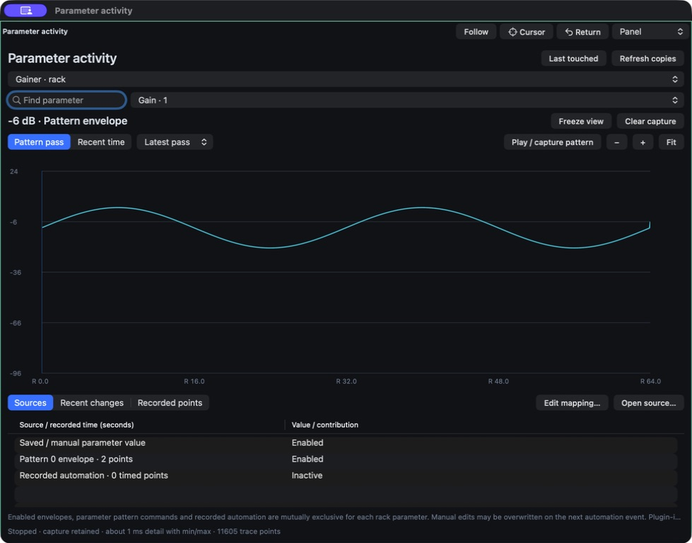

# Parameter activity — 23 September 2026

Implemented a dockable Mac **Parameter activity** inspector with a shared realtime capture core.
Open it with **Control–Option–0**, the **Activity…** button in plugin/automation controls, or a parameter's context menu. Choose a processor copy and parameter; use **Play / capture pattern** to capture one pattern through the real engine.

## What is available

- A zoomable, source-colored trace of the value delivered to the selected plugin parameter. Switch between a captured pattern pass and recent song time; older captured passes remain selectable. Editing and playback positions appear in pattern mode. Freeze and clear controls affect diagnostics only.
- A list of controlling/potential sources and a recent-change history. Select a trace point or source and use **Open source** to return to an envelope, PS/PL pattern cell, plugin controls or a graph source. **Edit mapping** opens a graph modulation connection.
- Graph copies are identified separately by graph, processor, bus/instrument/channel and row/persistent/ordinary role. The panel shows normalized source contributions, their base, and clamping of the sum; the final trace uses native plugin units.
- Recorded automation is now visible in **Recorded points**, with editable song-time/value cells and add, update, move and delete operations. Edits preserve unrelated points, stop playback and support plugin Undo/Redo and project persistence.
- Seven API methods expose processor catalogs, source discovery, transient capture and recorded-point editing. Watch operations do not dirty the song; song edits retain revision checks, validation and atomic Undo.

## Semantics and limits

This is an actual-playback diagnostic, not a prediction of an unplayed pattern. External input, random sources, sidechains and stateful plugins make a speculative trace misleading. Captures expire at a bounded 32768 entries and preserve approximately millisecond detail plus extrema and source changes. Plugin-internal modulation/smoothing and MIDI mappings hidden inside plugins cannot be inspected through the host parameter interface. Custom UI edit timestamps indicate when the host receives the edit notification.

Rack envelopes, PS/PL commands and recorded automation keep their existing conflict validation. Manual changes may be overwritten by subsequent automation. Graph modulation combines contributions instead. A copy's audibility flag describes its activity/wet gate and optional tail, not downstream faders/mute or measured signal energy.

The source list shows the latest graph contributions; the API retains sampled contribution history alongside the final-value trace. This UI does not yet overlay historical curves for individual contributors.

One parameter is monitored per application session. Other API clients can change that selection; callers must check its target and token. Captures are transient, not stored in song files. Captured data remains after stopping until a new engine or capture replaces it.

This iteration uses a movable/dockable panel, not vertical graph columns inside the pattern grid. The capture core is shared; the Windows-native inspector and corresponding Windows API adapter have not been added.

## Validation

- 77/77 CTests passed; the focused parameter suite also passed after the last audio/API corrections. The tests compare retained values against rendered PCM for step/slide commands at 1, 17, 128 and 4096-frame buffer sizes; cover musical clock boundaries, envelope/recorded provenance, independent graph copies, queue overflow, no realtime allocations/frees/locks, Undo/Redo and persistence.
- The full socket/API suite passes, including method/schema coverage, transient non-dirty watches, strict numeric bounds, revision guards, recorded edits and collision rejection.
- Core Audio loopback passes for dry, AU effect, VST3 effect with automation, VST3 instrument with automation, AU instrument and graph copies with fractional commands. Each case compared 96,000 stereo frames at 48 kHz / 512 frames: maximum PCM error 0, zero timestamp discontinuities and zero callback overruns. Parameter capture was active for the VST3 automation and graph cases, with source checks and zero queue drops. This does not measure physical DAC latency.
- A running QA app captured a full scripted-envelope pattern: 11,605 trace points, approximately −21.6…+2.4 dB, 48 kHz / 128 frames, zero audio overruns, no engine/plugin fault, unchanged document revision. A separate graph capture contained 23,812 final-value points and 17,322 base/amount/LFO contribution points. Full captures are compressed alongside summary JSON.
- Native UI inspection confirmed parameter selection, the automation-to-activity shortcut, the expanded floating panel, the plotted captured curve and its source list. A floating-window source-navigation defect found here was corrected, then verified by opening the exact envelope from the floating monitor. Recorded points were displayed and an edit was verified against the live API. In the final signed build, double-clicking a value opened the inline editor; typing −25 and pressing Return updated the point at 1 second while preserving the second point. The verification response is saved as `inline-recorded-edit.json`.
- The complete AppKit interface suite passed, covering stable target identity, stale replies, source links, step-versus-slide rendering, trace zoom and a competing API client changing the capture target. A precise-note debounce test that failed while the compiler was saturating the machine passed on the serialized run. The final suite also passed the added inline recorded-cell regression: a real AppKit field editor opens, commits a new value, and retains the original point time and parameter identity.
- Sustained display cadence remains unverified. The presentation test stopped before measurement because macOS reported the QA window as occluded/off the visible desktop, despite the app being active and its controls and window snapshots remaining available. No 60 fps claim is made from these snapshots. The failed precondition and build identity are retained in `presentation-unavailable.json`.

Evidence: [qualification directory](mac-native-qualification/2026-09-23-parameter-activity/), [API documentation](../mac/AUTOMATION.md).

The screenshot comes from the running QA application. It demonstrates layout and captured data, not sustained display cadence.

## Build

- Bundle: `bin/mac-parameter-activity/ScreamSeq.app` (separate development build).
- Base commit: `d5d376fa0ced527cc901d8555076cadbf98d75d4`; existing uncommitted work remains present.
- Build time: `2026-09-23T07:19:03.404922+00:00`.
- Source fingerprint: `0a188e60cf5453d7c4567bb38f78753e5950cac387d4d6e82240706711e3856f`.
- Executable SHA-256: `688dd0396fc153006a779c8f340b3cab052b6f754f4afd83c811f08493b090a3`.
- Packaged source hashes match the working sources; `codesign --verify --deep --strict` passes.

No commit or push was performed for this task.
